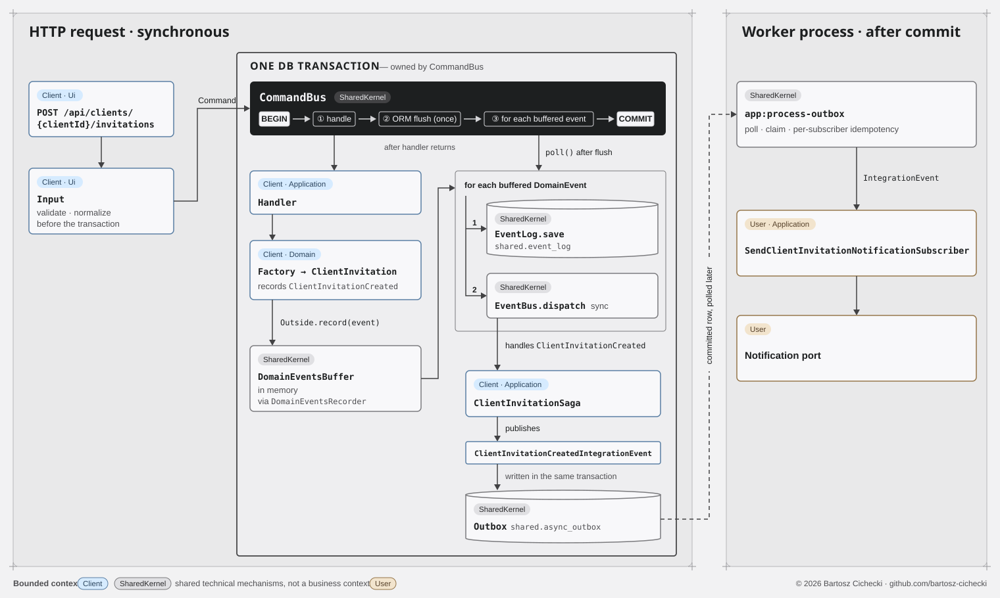

# Pragmatic Software Engineering Demo

This repository is a public demo of pragmatic, modern software engineering with AI-assisted development. It was created as a publishable side effect of a larger commercial project that cannot be open sourced.

The goal is not to present Domain-Driven Design as an end in itself. The goal is to show how clear architecture, testable business flows, quality gates, and disciplined boundaries make software easier to build, review, and extend with both humans and AI coding agents.

Large parts of this codebase were produced with AI support and natural-language instructions. The repository demonstrates the practical lesson behind that workflow: LLMs can be a strong productivity lever, but they raise the bar for architectural clarity, tests, and engineering rigor.

The architectural rules are part of the demo, not an afterthought.

## AI-assisted development

Natural language is treated here as a higher-level interface for software delivery: requirements, constraints, architecture rules, test expectations, and implementation steps can be expressed in a form that is readable by both engineers and coding agents.

Most of the implementation was built with AI assistance, but the AI was not treated as a replacement for engineering judgment. The useful pattern is:

- clear boundaries before generation,
- small and reviewable changes,
- behavior covered by tests,
- quality gates that can reject incorrect output,
- architecture rules that are explicit enough for a human or agent to follow.

In this model, AI helps deliver faster. It does not remove the need for design discipline, automated checks, or careful review.

## Vendor-agnostic engineering

This project is intentionally not tied to a specific LLM, coding agent, or vendor workflow. The repository should be understandable and approachable for a human engineer and for an AI agent from any vendor.

That requires written rules, predictable structure, stable commands, and enforced boundaries. **The architecture guide defines those rules:** [English translation](docs/architecture.en.md) / [Polish canonical version](docs/architecture.md). Current behavior and HTTP contracts are documented separately in the [platform guide](docs/platform.md).

The same constraints that make the project easier to onboard for people also make it easier for agents to work safely: explicit layers, bounded contexts, clear test strategy, and repeatable quality gates.

## Engineering approach

The demo uses DDD and related patterns as engineering tools, not as branding:

- **Bounded contexts**: User (OTP auth), Client (tenant/membership management); SharedKernel provides shared mechanisms
- **Domain rules in the domain**: aggregates protect invariants and expose behavior
- **Outside pattern**: domain reads external state without side effects through Outside interfaces
- **CQRS-lite**: Commands for writes, DBAL Queries for reads, no ORM on the read side
- **Quality gates**: cs-check, phpstan, deptrac-ci, phpunit, behat
- **UTC clock**: shared ClockInterface with SystemClock/MutableClock and UTC-normalized DateTime storage
- **Async outbox**: IntegrationEvent -> Postgres outbox -> worker -> async subscriber, with idempotent consumption

## Architecture flow

One real request, a client admin inviting a person, traced from HTTP through a single `CommandBus` transaction to the asynchronous notification in another bounded context.

<a href="https://raw.githubusercontent.com/bartosz-cichecki/demo/main/docs/architecture-flow/architecture-flow-light.svg">
<picture>
  <source media="(prefers-color-scheme: dark)" srcset="docs/architecture-flow/architecture-flow-dark.svg">
  
</picture>
</a>

## Dev setup

Start the environment:

```bash
make up-build
```

Run a smoke check:

```bash
make smoke
```

Common commands:

```bash
make up             # start without rebuilding
make down           # stop containers
make qa             # style + phpstan + deptrac
make test           # PHPUnit
make behat          # end-to-end acceptance tests
make cs-check       # code style dry run
make phpstan        # static analysis
make deptrac-ci     # architecture boundaries
```

`make smoke` checks the [platform health endpoints](docs/platform.md#1-scope-and-responsibilities).

Contributor workflow, quality gates and migration commands: [contributor instructions](docs/instructions-for-agents.md).

## Business capabilities

The aggregates model concrete business responsibilities:

- **Client** represents a tenant workspace, validates its name and prevents changes to its name or description while inactive.
- **ClientMember** controls a user's roles and access within a tenant, allowing suspension and restoration without deleting the membership.
- **ClientInvitation** makes membership depend on the invitee's consent and prevents duplicate pending invitations or inviting an existing member.
- **User** provides one identity across tenants and requires an explicit reason when blocking an account.
- **OtpChallenge** enables passwordless login with expiring, single-use codes and a limit on verification attempts.

## Key flows

Each flow is backed by executable Behat scenarios:

- **Client onboarding:** platform admin creates a workspace and invites its first administrator → invitee logs in and accepts → admin membership is granted — [client_onboarding.feature](app/tests/Behat/features/platform/client_onboarding.feature).
- **OTP login:** request a code → read it from the demo mailbox → verify it → authenticated session with no active client — [user_registration.feature](app/tests/Behat/features/user/user_registration.feature).
- **Client selection:** list active memberships → choose or switch the active tenant → access its resources — [active_client_selection.feature](app/tests/Behat/features/user/active_client_selection.feature).
- **Membership by invitation:** tenant admin invites → asynchronous notification → OTP login → acceptance creates membership and selects the client — [client_invitation.feature](app/tests/Behat/features/client_invitation/client_invitation.feature).
- **Membership suspension:** admin suspends a member → access is denied → unsuspending restores access while preserving the member record — [client_member_management.feature](app/tests/Behat/features/client_member/client_member_management.feature).
- **Platform isolation:** a tenant user attempts to create a client → access is denied — [client_create_forbidden.feature](app/tests/Behat/features/tenant/client_create_forbidden.feature).

Full HTTP contracts, session behavior and runtime details are documented in the [platform guide](docs/platform.md).
